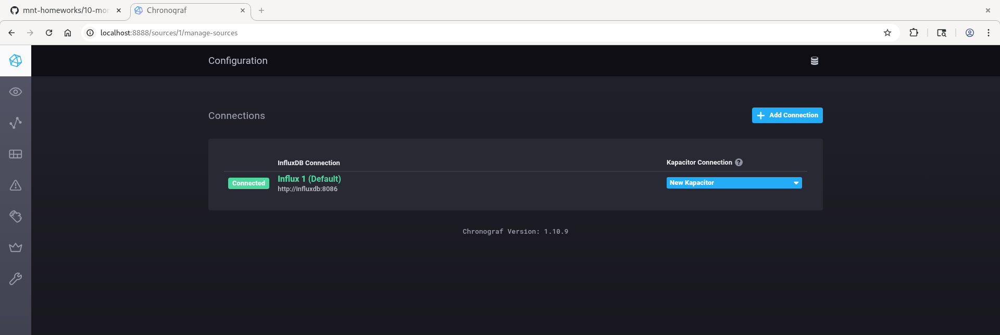
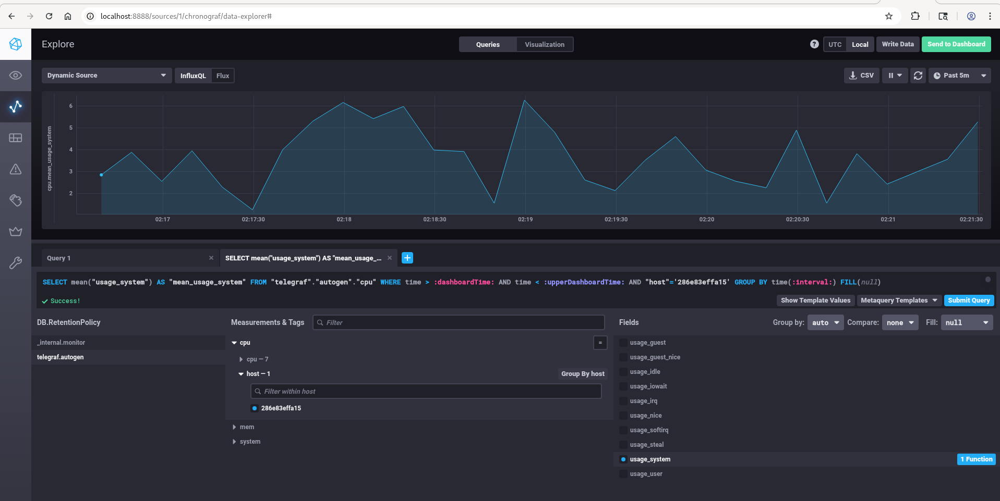
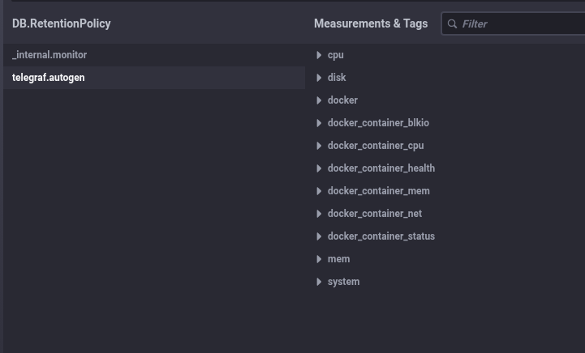

# 10-monitoring-02-systems

### 1. Надо мониторить CPU,RAM,диски + HTTP.

Метрики:

cpu_usage_user, cpu_usage_system, load_average_1m, load_average_5m, load_average_15m, memory_used_bytes, memory_available_bytes, memory_cached, disk_used_bytes, disk_free_bytes, disk_usage_percent, inodes_free, inodes_used_percent, disk_read_iops, disk_write_iops, disk_read_bytes, disk_write_bytes, disk_await, http_requests_total

Плюс нужно мониторить количество обработанных задач всего, успешно и с ошибкой.

### 2. SLA / SLI / SLO

SLI: доля успешных HTTP-запросов (2xx и 3xx) / все запросы

SLO: например, 99.5% успешных запросов за месяц

Доступность платформы (up/down по HTTP healthcheck)

Частота сбоев вычислений

Для менеджера можно вывести эти показатели на дашбор.

### 3. Нет финансирования на систему сбора логов, но разработчики хотят видеть ошибки приложения.
Бюджетное решение (почти бесплатное):

Чтение ошибок из системного журнала и отправка их либо в чат-бот либо на почту с определённым интервалом.

### 4. SLA = 99% по HTTP кодам, формула: sum_2xx / sum_all_requests, но SLA не выше 70%, хотя нет ошибок 4xx и 5xx.

В лекции в формуле ещё учитывались sum_3хх_requests. То есть формула не верна, она не считает ответч с типом 3xx.

### 5. Плюсы и минусы pull и push систем мониторинга

Плюсы pull:

Проще проверять работоспособность узлов (если не отвечает — он не работает)

Легче настраивать на одном сервере

Минусы pull:

Нужна прямая связь от мониторинга до узлов

Плюсы push:

Можно буферизировать на клиенте при проблемах с сетью

Минусы push:

Риск потерять данные при перезапуске агента

### 6. Какие системы к какой модели относятся

Гибридные: Zabbix, VictoriaMetrics

pull: Nagios, Prometheus

push: TICK

### 7. Результат

  

### 8. Результат

  

### 9. Результат

  

